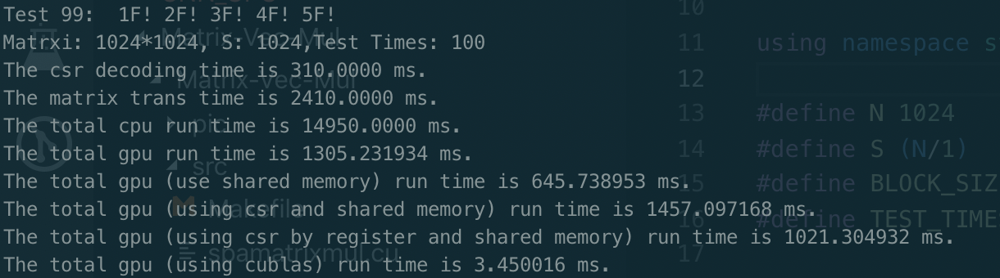
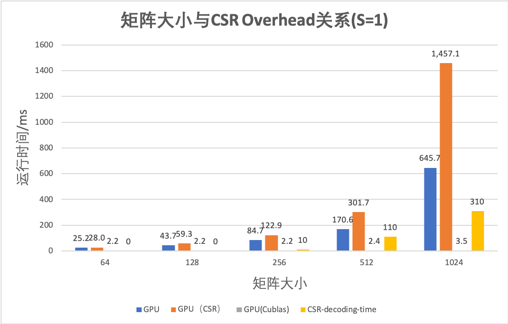
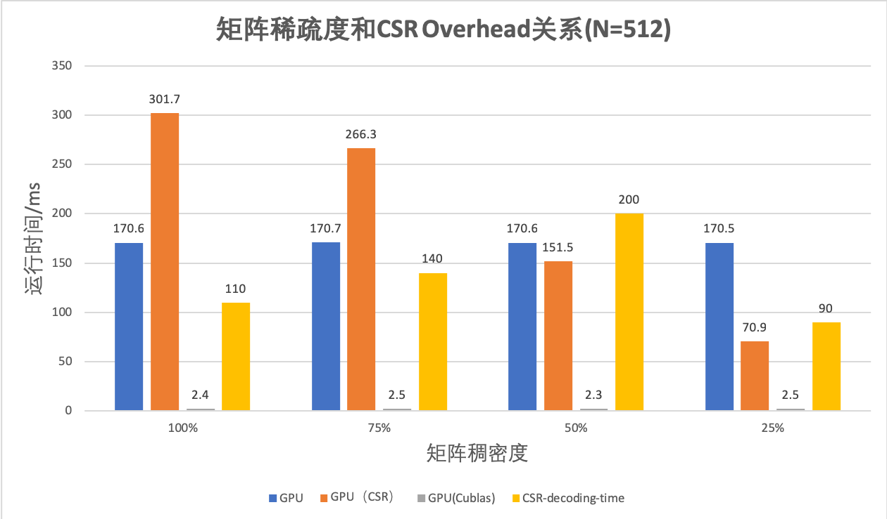
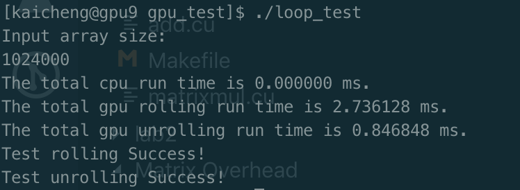
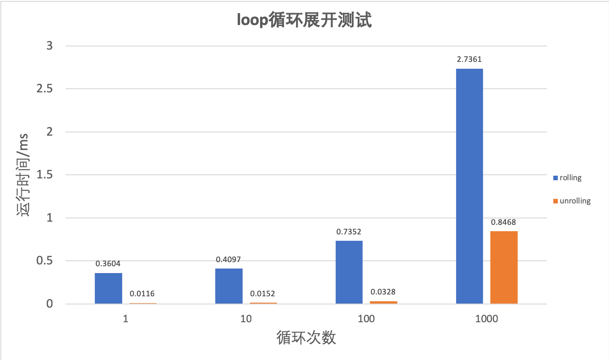

# Overhead测试

本内容实现了对稀疏矩阵与密矩阵、for loop的两个Overhead的测试

## 稀疏矩阵与密矩阵 Overhead 测试

### 一、设计原理

- 使用与之前矩阵向量相乘的模型，调整稀疏度和矩阵大小
- 当矩阵为密矩阵时，设置密度S=1，即可表示将矩阵中填满数字，此时使用GPU(已优化)与GPU(CSR存储优化)、Cublas库函数进行对比测试，选择大小为64~1024。
- 当矩阵大小固定为512时，调整矩阵密度，得到与上一点中相同的不同结果。

### 二、测试结果

* 原程序测试截图已保存在pic中（下图为N=1024，S=1的示例）。

* 实际测试时，为了保证数据稳定性，每个数据点均采用随机产生的100组数据运算得到结果，并对总用时进行累加。

### 三、结果分析

#### 1、固定矩阵为密矩阵时，调整矩阵大小得出图像如下：

可以看出随着矩阵大小的上升，矩阵CSR所带来的Overhead逐渐上升，从开始的几乎比例为1上升到CSR后花费了超过2倍的时间。另外在CPU中将矩阵转为CSR存储的时间也已测出，可见转换CSR时所需时间也在不算上升。

#### 2、固定矩阵大小时，调整矩阵密度得出图像如下：

可以看出从左到右随着矩阵密度下降，GPU本身的计算速度没有改变（因为算法和计算量都没有实际变化），但CSR存储的计算效率显著上升，从最开始GPU直接计算用时的1.71倍逐渐下降到0.41倍，根据图像走势估计大约在密度为50%时两种方法得到的计算时间相似，但考虑到CSR还有在cpu上decoding的时间，所以可能实际使用CSR的Overhead更大。

## For loop展开的Overhead测试

### 一、设计原理

* 为测试for loop在GPU上展开所存在的Overhead设计本测试。
* 测试中设计了一个数组加法，始终使用256*4=1024threads并行，调整数组程度即可确定循环的实际次数，如数组长度为102400时，即每个数组内循环计算加法100次。
* 编写两个核函数，一个核函数内使用for循环完成，另一个手动展开（写了1000个判断-加法语句），因此可以测试最多1000次循环的展开（想写10000次但是程序过长编译总是卡住）。

### 二、测试结果

* 分别测试了循环长度为1、10、100、1000的两个核函数运行时间。
* 进行了数组计算结果的正确性测试，得到结果如下图（循环次数：1000）

### 三、结果分析

对测试结果进行图像分析得：

如上图可以看出for循环的非展开与手动展开运算时间差别较大，在循环次数为1时有近31倍的效率差，但随着循环次数增多，运行时间之比逐渐减小，1000次循环时非展开大约只有展开的3.23倍时间。